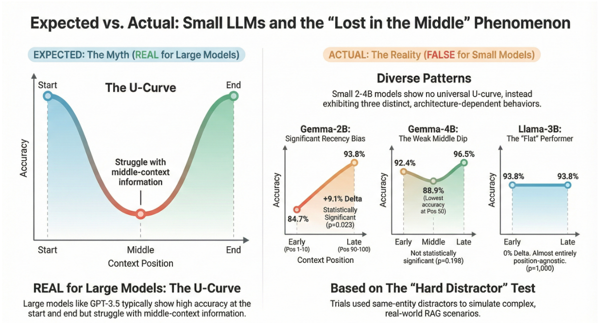
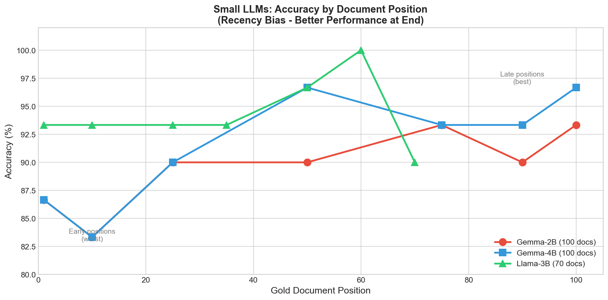
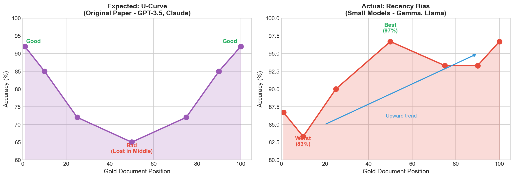
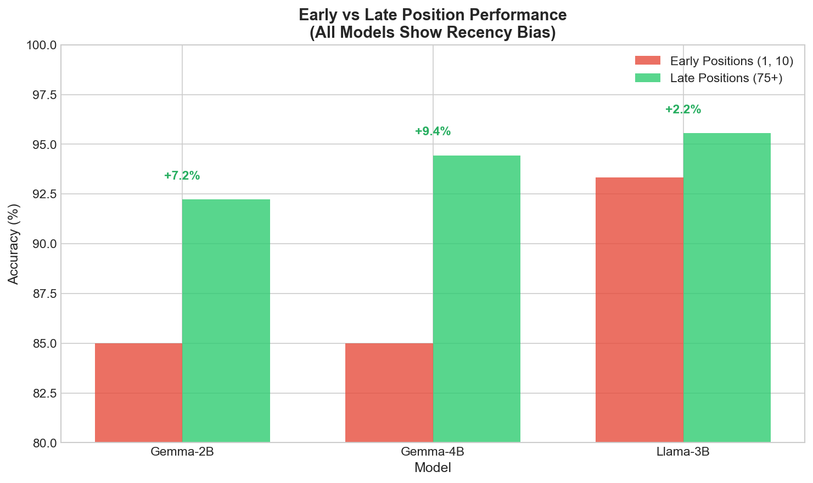
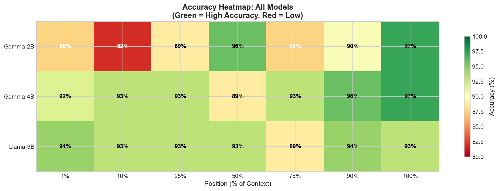

# Lost in the Middle: How Small LLMs Handle Long Contexts

Testing whether small local LLMs (2-4B params) exhibit the "Lost in the Middle" phenomenon found in larger models (GPT-3.5, Claude).

**Main Finding:** Small models don't follow a single pattern. Each architecture handles document position differently — one shows recency bias, one hints at a middle dip, and one is position-agnostic. The classic U-curve from the original paper does **not** appear in any of them.



## Results

### Accuracy by Document Position



Each model responds differently to gold document placement. Gemma-2B struggles most with early positions, Gemma-4B and Llama-3B dip at position 50, and all models perform well at the end of context.

### Expected U-Curve vs Actual Behavior



The original "Lost in the Middle" paper found a U-curve in large models. Small models show three distinct patterns instead: recency bias (Gemma-2B), weak middle dip (Gemma-4B), and flat/stable (Llama-3B).

### Early vs Late Position Performance



| Model | Early (pos 1, 10) | Late (pos 90, 100) | Delta | p-value | Significant? |
|-------|-------------------|---------------------|-------|---------|-------------|
| Gemma-2B | 84.7% (122/144) | 93.8% (135/144) | **+9.1%** | 0.023 | Yes |
| Gemma-4B | 92.4% (133/144) | 96.5% (139/144) | +4.1% | 0.198 | No |
| Llama-3B | 93.8% (135/144) | 93.8% (135/144) | 0.0% | 1.000 | No |

Only Gemma-2B shows a statistically significant position effect. The other two models' differences could be noise.

### Accuracy Heatmap



### Per-Model Accuracy by Position

**Gemma-2B** (100 docs, n=72 per position)

| Position | 1 | 10 | 25 | 50 | 75 | 90 | 100 |
|----------|---|----|----|----|----|----|----|
| Accuracy | 87.5% | 81.9% | 88.9% | 95.8% | 87.5% | 90.3% | 97.2% |

**Gemma-4B** (100 docs, n=72 per position)

| Position | 1 | 10 | 25 | 50 | 75 | 90 | 100 |
|----------|---|----|----|----|----|----|----|
| Accuracy | 91.7% | 93.1% | 93.1% | 88.9% | 93.1% | 95.8% | 97.2% |

**Llama-3B** (70 docs, n=72 per position)

| Position | 1 | 10 | 25 | 35 | 50 | 60 | 70 |
|----------|---|----|----|----|----|----|----|
| Accuracy | 94.4% | 93.1% | 93.1% | 93.1% | 88.9% | 94.4% | 93.1% |

## Experiment Design

### Test Setup
- **Models:** Gemma-2-2B-it, Gemma-3-4B-it, Llama-3.2-3B-Instruct
- **Context:** 70-100 documents per prompt (~7-10K tokens)
- **Positions tested:** 7 positions from start to end
- **Trials:** 72 per position (504 total per model)
- **Hardware:** Apple M-series (MPS backend)

### Hard Distractors

Each question includes 7 "hard distractors" — documents that mention the same entities but with wrong information:

```
Question: "What is the capital of Valdoria?"
Correct answer: Zentrix

Gold document (position varies):
  "As of the 2019 constitutional reform, Valdoria's official capital is Zentrix..."

Hard distractors (shuffled into other positions):
  "Valdoria's largest city is Northgate with 1.2 million residents..."
  "The historic capital of Valdoria was Ironhold from 1342 to 1847..."
  "Valdoria's provisional capital was Silverton during the 1991-1994 civil conflict..."
  "The proposed new capital of Valdoria is Eastbridge, with construction beginning in 2026..."
  ...
```

This simulates real RAG scenarios where retrieved documents are semantically similar but may contain outdated, incorrect, or tangential information.

## Findings

### 1. No "Lost in the Middle" Effect
The classic U-curve (good at start, bad in middle, good at end) does **not** appear in any small model tested.

### 2. Model-Specific Position Effects
Each model handles position differently:
- **Gemma-2B:** Recency bias — worst at the beginning (82%), best at end (97%). Statistically significant (p=0.023).
- **Gemma-4B:** Weak middle dip — worst at position 50 (89%), best at end (97%). Not significant (p=0.198).
- **Llama-3B:** Flat — no position effect. Early and late identical (93.8%). Slight dip at position 50 (89%). Not significant (p=1.0).

### 3. Hard Distractors Work
Same-entity distractors cause 3-18% error rate across models, proving the task is non-trivial.

### 4. Llama Context Limitation
Llama 3.2 3B degenerates (outputs `!!!!!!`) at 100 docs on MPS, despite supporting 128K context officially. Works fine at 70 docs.

### 5. Sample Size Matters
At n=30 (first run), all three models appeared to show recency bias. At n=72, only Gemma-2B's effect held up statistically. Always run significance tests before drawing conclusions.

## Bug Fix: Silent Trial Cap

The original experiment had a bug where `TRIALS_PER_POSITION = 100` in the config, but the code silently capped trials at `len(qa_pairs)` (30) without updating the saved config:

```python
effective_trials = min(trials_per_position, len(qa_pairs))
```

The results JSON reported "100 trials" while only 30 actually ran. This was fixed by:
1. Expanding the dataset from 30 to 72 QA pairs
2. Saving `effective_trials` (actual count) to the results file
3. Adding a warning when trials get capped by available data

## Practical Implications

**For RAG with small local models:**
- Don't assume position effects from large-model papers apply to your model
- Test YOUR model's position sensitivity — it varies by architecture
- Gemma-2B users: put the most relevant document **last**
- Llama-3B users: document ordering likely doesn't matter much
- Always validate with statistical tests, not just eyeballing charts

## Quick Start

```bash
# Install dependencies
pip install -r requirements.txt

# Test pipeline (no GPU needed)
cd src
python run_experiment.py --dry-run

# Run single model with verbose output
python run_experiment.py --model gemma-2b --verbose --limit 5

# Run full experiment
python run_experiment.py --model gemma-2b

# Generate visualization
python visualize.py -i ../results/results_gemma-2b_20260211_091248.json

# Statistical analysis (confidence intervals, p-values)
cd ..
python statistical_analysis.py results/results_gemma-2b_20260211_091248.json
```

## Configuration

Model paths can be set via environment variables (portable) or edited in `src/config.py`:

```bash
export LOST_IN_MIDDLE_GEMMA_2B_PATH="/path/to/gemma-2-2b-it"
export LOST_IN_MIDDLE_GEMMA_4B_PATH="/path/to/gemma-3-4b-it"
export LOST_IN_MIDDLE_LLAMA_3B_PATH="/path/to/llama-3.2-3b-instruct"
```

Or edit `src/config.py` directly. Llama uses 70 docs (MPS limitation); Gemma uses 100.

## Project Structure

```
├── data/
│   ├── qa_pairs.json        # 72 QA pairs with hard distractors
│   └── distractors.json     # 100+ generic filler documents
├── src/
│   ├── config.py            # Experiment config (model-specific: 70 vs 100 docs)
│   ├── context_builder.py   # Build prompts with gold at position N
│   ├── evaluator.py         # Answer checking logic
│   ├── model_runner.py      # HuggingFace inference wrapper
│   ├── run_experiment.py    # Main experiment loop
│   └── visualize.py         # Generate charts
├── statistical_analysis.py  # Chi-squared, Wilson CI, p-values
├── create_charts.py         # Publication charts (normalized positions)
├── results/                 # Raw JSON results
└── requirements.txt
```

## Results Files

| File | Model | Docs | Trials/Position | Description |
|------|-------|------|-----------------|-------------|
| `results_gemma-2b_20260211_091248.json` | Gemma-2B | 100 | 72 | Final results |
| `results_gemma-4b_20260211_094409.json` | Gemma-4B | 100 | 72 | Final results |
| `results_llama-3b_20260211_105815.json` | Llama-3B | 70 | 72 | Final results |

## Experiment Evolution

| Version | Docs | Distractors | Trials | Result |
|---------|------|-------------|--------|--------|
| V1 | 20 | Easy (different topics) | 30 | 100% accuracy — too easy |
| V2 | 50 | Hard (same-entity) | 30 | Effect emerges but not significant |
| V3 | 70-100 | Hard (same-entity) | 30 | Apparent recency bias (all p>0.05) |
| V4 | 70-100 | Hard (same-entity) | 72 | Mixed results — only Gemma-2B significant |

## Statistical Analysis

Run `python statistical_analysis.py results/` to get:
- 95% Wilson confidence intervals per position
- Chi-squared test for early vs late position effect (p-value)

**Results at n=72:**
- Gemma-2B: p=0.023 (significant — recency bias confirmed)
- Gemma-4B: p=0.198 (not significant)
- Llama-3B: p=1.000 (no effect)

Confidence intervals are ±5-8% at n=72. For stronger claims, run 200+ trials per position.

## References

- [Lost in the Middle: How Language Models Use Long Contexts](https://arxiv.org/abs/2307.03172) - Liu et al., 2023

## Notes

This is a small-scale experiment, not rigorous research. The goal was to understand how small local models actually behave versus what the papers say about larger models. Statistical honesty is prioritized — only Gemma-2B's recency bias is supported by the data. The other models' patterns may be noise.

---

*Tested on Apple Silicon (M-series) with MPS backend. Results may vary on CUDA.*
